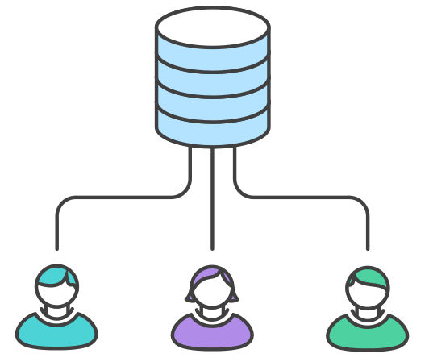
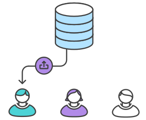
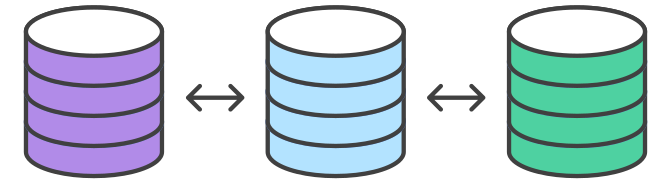

# Pleasurable User Interface

## Feature branches & Pull requests

Deze week hebben we _Branches_ en _Pull Requests_ geïntroduceerd. Door deze manier van werken maak je jezelf klaar voor het bedrijfsleven. Zodra je in een team werkt kan je werk op deze manier makkelijk, snel en goed gereviewed worden.

Als de teamleden in een _branch_ werken, kun je code aanpassen, toevoegen en verwijderen zonder dat de anderen daar last van hebben. Zo kan je tegelijk aan onderdelen van een website werken. Als een _branch_ af is en goed bevonden, kan je deze met een _Pull Request_ _mergen_ naar de _main_ branch.

## Branches
Met een _Branch_ maak je een afsplitsing van de _main_, je kopieert alles mee, maar zolang je op de afgesplitste _branch_ werkt, zie je jouw commits ook alleen maar op die _branch_.

Op GitHub.com en in de GitHub Desktop App kan je zien welke Branches er op een repository zijn en welke actief is. Hier kan je ook een nieuwe branch aanmaken of wisselen tussen branches.

👉 Check op GitHub welke branches er nu zijn in jullie teamproject. Maak met je team een schematische tekening op het whiteboard van hoe jullie repository er nu uitziet, welke branches zijn er, hoe heten ze, wie werkt in welke branch, en/of welke branches zijn al gemerged met de main?


<!-- ### Naamgeving van branches -->


<!--
### Branches met Git commands

Als je Git hebt geinstalleerd kan je in de Terminal branches aanmaken en wisselen. 

In de Terminal toon je een lijst met alle branches met:
```
git branch 
```

In de Terminal maak je een nieuwe feature branch aan met:
```
git branch name_of_the_branch
```

En je kan in de Terminal ook branches wisselen met:
```
git checkout name_of_the_branch
```

👉 Check eens in je project in de Terminal welke branches er nu zijn.
-->

### Bronnen

- [About branches - GitHub](https://docs.github.com/en/pull-requests/collaborating-with-pull-requests/proposing-changes-to-your-work-with-pull-requests/about-branches)
- [Creating and deleting branches within your repository](https://docs.github.com/en/pull-requests/collaborating-with-pull-requests/proposing-changes-to-your-work-with-pull-requests/creating-and-deleting-branches-within-your-repository)
- [De Network Graph van onze repository](https://github.com/fdnd-task/pleasurable-ui/network)

## Pull request

Om jouw _branch_ weer samen te voegen naar _main_ doe je een _Pull Request_. Met een _pull request_ vraag je of iemand anders jouw aanpassing wil checken en toe wil voegen aan de _main branch_.

_Pull requests_ doe je het beste op GitHub.com. (Het kan in de Github Desktop App of in de Terminal, maar dat is een gedoe.)

Als je een Pull Request klaarzet, schrijf je instructies voor de reviewers. Schrijf wat jouw branch doet, wat het is, wat je al getest hebt, en wat je van de reviewer verwacht. Misschien wil je op een specifiek onderdeel extra nadruk leggen.

👉 Bij FDND Agency gebruiken ze verschillende [conventies](https://github.com/fdnd-agency/.github/wiki/Conventions) voor code en samenwerken. Voor Pull Requests gebruiken ze [een template](https://github.com/fdnd-agency/.github/blob/main/pull_request_template.md). Bekijk het template en maak met je team een eigen template voor deze sprint, die jullie kunnen gebruiken.

### Bronnen

- [About pull requests](https://docs.github.com/en/pull-requests/collaborating-with-pull-requests/proposing-changes-to-your-work-with-pull-requests/about-pull-requests)
- [Creating a pull request](https://docs.github.com/en/pull-requests/collaborating-with-pull-requests/proposing-changes-to-your-work-with-pull-requests/creating-a-pull-request?tool=webui)


### Merge
Bij een merge voeg je twee branches samen, zodat je verder kunt werken op één punt.

Je kunt mergen in GitHub Desktop of in de Terminal.

<!-- 
`git checkout main` wissel naar main

`git merge feature` merge de branches

`git branch –d feature` verwijder branch 
-->

#### Merge conflicts
Als je 2 versies van hetzelfde bestand samenvoegt, kan er een probleem optreden. Een zogenaamd _merge conflict_. Dit gebeurt meestal als _dezelfde_ regels code zijn veranderd. Git weet dan niet welke versie van de regels de juiste zijn, en vraagt om assistentie. Je kunt handmatig het merge conflict oplossen of het in de Visual Studio Code interface uitvoeren.

<!-- git merge – merge a specified branch into the current one -->


## Github workflows
Er zijn verschillende manieren van hoe je met een team kan samenwerken met Git en GitHub. 

### Centralized workflow
Deze manier van samenwerken hebben jullie al gedaan in Sprint 7. 

Met je team werk je op 1 repository en push je wijzigen direct naar het originele project. 



- Maak een repository aan op GitHub
- Clone de repository naar lokaal
- Maak aanpassingen en commit
- Push aanpassingen naar GitHub

Conflicten zijn vrij normaal in deze setting.


### Feature branch workflow
We maken deze sprint gebruik van de Feature branch Workflow. 

Teamleden maken per feature een branch en mergen deze met een Pull Request naar GitHub. Je kunt hierdoor aan verschillende features (issues) tegelijk werken, in verschillende branches. 



- Maak een repository aan op GitHub
- Maak een nieuwe branch voor jouw feature
- Clone (of pull) de repository naar lokaal
- Maak aanpassingen en commit deze naar de branch
- Push jouw aanpassingen naar GitHub
- Maak een pull request op GitHub

<!-- Dit kan dus ook helemaal op de CLI, maar doe het vooral in GHD!
git checkout -b new-feature switch naar de nieuwe branch git commit -a –m ‘Built new-feature! Resolves #42’ commit aanpassingen
git push -u origin new-feature push jouw feature naar GitHub…
… doe een pull request op GitHub -->

### Forking workflow
In Semester 3 ga je leren werken met de forking workflow. 

Alle teamleden forken de repository, maken wijzigingen in branches op hun eigen fork en met een pull request gaan de wijzigingen naar het originele project. 



- Fork de repository op GitHub
- Maak een nieuwe branch voor jouw feature op jouw remote
- Clone (of pull) de repository van jouw remote naar lokaal
- Maak aanpassingen en commit deze
- Push jouw aanpassingen naar jouw remote GitHub
- Maak een pull request van de feature branch op jouw remote naar het originele project op GitHub

<!-- Ook dit kan op de CLI maar … weet waar je aan begin… -->


## Richtlijnen voor de Feature branch workflow

Om het werken met branches en pull requests soepel te laten verlopen, zijn een aantal richtlijnen wel handig. Je zult later merken dat elk bedrijf of team het weer net even anders doet, maar over het algemeen kun je met deze tips makkelijker samenwerken.

### Nieuw issue = nieuwe feature branch
Elke keer dat je met een nieuw issue aan de slag gaat, kun je het best een nieuwe _feature branch_ aanmaken voor dat issue. Vaak gebruik je als naam voor zo'n branch een korte titel en het nummer van het issue zelf, bijvoorbeeld `header-22`, `speaker-detail-13`, `partners-5`, `feature/footer-2`, `feature-issue-5`, etc. 
<!-- Het is dus _niet_ handig om continu in één branch te werken, die je bijvoorbeeld jouw naam geeft. Je werkt dan wel afgeschermd van de `main` branch, maar nog niet met _feature branches_. (Het kan ook prima voorkomen dat verschillende teamleden in dezelfde feature branch werken, wat nog een reden is om een branch niet naar jezelf te vernoemen.) -->

Het is niet handig om continu in één branch te werken.
Maak een branch voor een _feature_, maak een pull request, check je code en merge. 

<!-- ### 
Je kunt hierdoor aan verschillende features (issues) tegelijk werken, in verschillende branches. Soms blijkt werk net wat complexer, moet dat even wachten, en ga je door met een ander issue. Je gaat dan dus op een andere branch verder (via een _checkout_). Net als dat je commits koppelt aan de juiste issues, voer je je werk ook uit in de juiste feature branch. Hiermee maak je het ook mogelijk om verschillende pull requests bij verschillende teamleden neer te leggen. -->

### Werk niet te lang in een branch
Probeer niet te lang in dezelfde branch te werken (maximaal een paar dagen), zodat je _Short-Lived Feature Branches_ krijgt. Als je te lang in dezelfde branch aan het werk bent, is dat een teken dat je issue te groot was. Waarschijnlijk is het dan slim om dat op te splitsen, zodat het werk beter behapbaar wordt.

### Gooi branches weg
Een andere richtlijn is dat je branches weggooit en opschoont, zodra ze gemerged zijn naar de `main` branch. Hiermee hou je je repository netjes en overzichtelijk, en kun je snel zien welke features in ontwikkeling zijn.
De Pull Requests die gemerged zijn, vind je op GitHub.com terug in een overzicht 'closed'.

<!-- Tijdens een standup met je team is het overzicht van branches een handige manier om te vertellen waar je mee bezig bent, waar je vastloopt en waar je hulp nodig hebt. -->

## Daily Standup

Als je samenwerkt, begin je elke dag met een _Standup_. Een goede manier om elkaar op de hoogte te houden van vorderingen of vastlopers. De Standup duurt nooit langer dan 15 minuten, daarom doe je een standup ook staand en zonder computer. Ook is het verstandig om dit niet bij je bureau te doen. Zo zorg je ervoor dat je niet naar code gaat kijken of gaat debuggen. Je lost problemen niet op, dat kan je daarna doen.

In de standup beantwoord je altijd 3 vragen
1. Wat heb ik gedaan sinds de vorige standup?
2. Wat ga ik vandaag doen?
3. Welke knelpunten verwacht je, en kan het team je daarbij helpen?

👉 Doe vandaag eerst een standup met je team voordat je weer in de code duikt!

### Bronnen
- [De Daily standup meeting: uitleg en tips](https://scrumguide.nl/daily-standup-meeting/)

